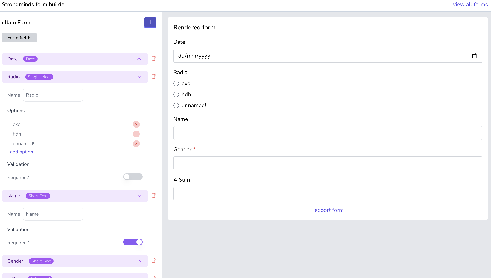

## Strong Minds Form Generator

### About Project
This is a form generator built with PHP in the backend and Javascript on the frontend  

I have used the Laravel framework to handle the backend and vue.js to hand frontend interactivity 
_*Screenshot*_

### Requirements to install and run this project
1. PHP >= 8.0
2. MySQL >= 8.0
3. Node >= 16.17
4. Composer >=2.5
5. npm >= 8.15

### Steps to install/deploy

- Clone this repository [allandereal / strongminds-form-builder](https://github.com/allandereal/strongminds-form-builder.git)
- Then run the following commands
1. `cd strongminds-test`
2. `composer update`
3. `npm update`
4. `cp .env.example .env`
5. Create a database named form_generator
6. Chang the `DB_DATABASE`, `DB_USERNAME` and `DB_PASSWORD` to match your new database credentials
7. `php artisan migrate --seed`
8. `php artisan key:generate`
9. `php artisan serve`  
In a new window, in the same directory, run the command below.
   10. `npm run dev` if in development or `vite build` if in production

Finally, visit [http://127.0.0.1:8000](http://127.0.0.1:8000) to view the application

### Running tests
To be able to run tests, please run the following commands
1. `cp .env.example .env.testing`
2. create a database named form_generator_test
3. Chang the `DB_DATABASE`, `DB_USERNAME` and `DB_PASSWORD` to match your new testing database credentials
4. `php artisan test`

